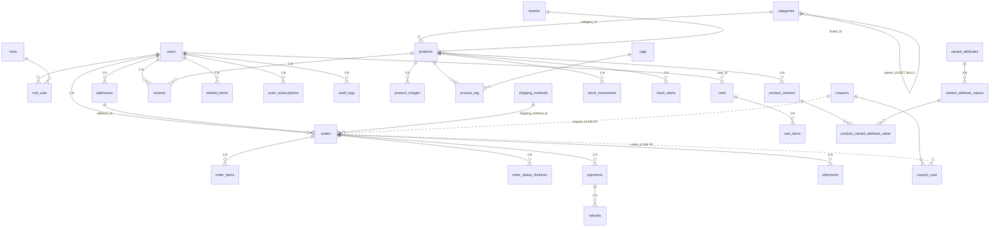

# 2 · Manual Técnico

**CommerceOS — guía para desarrolladores**
Versión 1.0 · 24/09/2026 · Verificado contra `route:list`, `information_schema` y el código fuente

---

## Índice

1. [Arquitectura general](#1-arquitectura-general)
2. [Arquitectura de frontend](#2-arquitectura-de-frontend)
3. [Arquitectura de backend](#3-arquitectura-de-backend)
4. [Estructura de código](#4-estructura-de-código)
5. [Base de datos](#5-base-de-datos)
6. [API](#6-api)
7. [Autenticación y autorización](#7-autenticación-y-autorización)
8. [Seguridad](#8-seguridad)
9. [Integraciones externas](#9-integraciones-externas)
10. [DevOps](#10-devops)
11. [Rendimiento](#11-rendimiento)
12. [Pruebas](#12-pruebas)

---

## 1. Arquitectura general

### 1.1 Estilo

**Monolito desacoplado por capas** con separación explícita de responsabilidades:

```
┌─────────────────────────────────────────────────────────────┐
│  Nuxt 4 (SSR/SPA)                                          │
│  pages → layouts → components → stores(Pinia) → services   │
└──────────────────────────┬──────────────────────────────────┘
                           │ HTTPS · JSON · Bearer token
┌──────────────────────────▼──────────────────────────────────┐
│  Laravel 9 (API REST stateless)                            │
│  routes → middleware(auth/permission/throttle)              │
│         → Controllers → Services → Models → MySQL          │
└──────────────────────────┬──────────────────────────────────┘
                           │
        ┌──────────────────┼──────────────────┐
        ▼                  ▼                  ▼
  Pasarelas de pago   Transportistas      SMTP / Web Push
  (6 adaptadores)     (5 adaptadores)     (notificaciones)
```

### 1.2 Decisiones clave

| Decisión | Implementación | Consecuencia |
|---|---|---|
| API stateless | Sanctum Bearer, 16 h | Escalable horizontalmente; sin sesiones de servidor |
| Autorización por archivo | `config/permissions.php` | Simple de desplegar; no editable desde UI |
| Respuestas uniformes | `ApiResponse {success, message, data}` | Cliente con manejo de error único |
| Dinero `decimal(18,2)` | Todas las tablas monetarias | Sin errores de punto flotante |
| Adaptadores Strategy | `PaymentProvider`, `ShippingProvider` | Añadir proveedor = añadir clase + `class_map` |
| Config clave-valor | tabla `settings` + helpers `store_setting()` | Configuración dinámica sin migrar BD |
| Auditoría por trait | `LogsActivity` en modelos | Auditoría sin código explícito |
| Offline-first | outbox + IndexedDB + background sync | La tienda sigue operando sin red |

### 1.3 Diagrama de despliegue (actual)

```
[Browser] ──► [Nuxt :3000] ──► [Laravel :8000] ──► [MariaDB 10.4 :3306]
                    │                  │
                    │                  ├──► [Archivo local storage/app/public]
                    │                  ├──► [SMTP]
                    │                  └──► [Pasarelas / Carrier APIs (HTTPS saliente)]
                    └──► [Service Worker + IndexedDB]
```

---

## 2. Arquitectura de frontend

**Stack:** Nuxt 4.5 · Vue 3 · Nuxt UI 4 · Pinia 4 · Tailwind CSS 4 · TypeScript · `@vite-pwa/nuxt`.

### 2.1 Capas y flujo de datos

```
pages/ (orquestación, SEO, definePageMeta)
   └── layouts/ (default | client | auth | admin | admin-editor)
         └── components/ (ui · feedback · navigation · ecommerce · dashboard · admin · client · forms · checkout)
               └── stores/ (Pinia — estado compartido entre layouts)
                     └── composables/ (Api, useFormat, usePageSections, offline…)
                           └── services/ (fachadas HTTP tipadas por dominio)
                                 └── types/ (contratos de dominio)
```

**Reglas.**
- Los componentes **no** hacen fetch: llaman a stores o services.
- Los services **no** conocen la UI: devuelven tipos de `app/types`.
- Toda mutación pasa por `runMutation()` para obtener toasts, cola offline y actualización optimista.

### 2.2 Páginas y rutas

| Grupo | Rutas | Layout | Middleware |
|---|---|---|---|
| Storefront | `/`, `/catalogo`, `/producto/:slug`, `/ofertas`, `/carrito`, `/nosotros` | `client` | — |
| Checkout | `/checkout`, `/checkout/pago/:id` | `client` | — |
| Auth | `/auth/login`, `/auth/register`, `/auth/recuperar` | `auth` | — (guest huérfano) |
| Cuenta | `/cuenta/perfil`, `/cuenta/pedidos`, `/cuenta/pedidos/:id`, `/cuenta/favoritos`, `/cuenta/notificaciones` | `client` | `auth` |
| Admin | `/admin` + 17 subrutas (productos, categorias, inventario, pedidos, pagos, envios, cupones, resenas, usuarios, reportes, configuracion, tienda, plantillas, preview, perfil) | `admin` (dinámico `admin-editor` en fullscreen) | `auth` |
| Estáticas | `/ayuda`, `/privacidad`, `/terminos` | ⚠️ `default` (sin navbar/footer) | — |

**36 páginas** en total.

### 2.3 Stores Pinia (19)

| Store | Responsabilidad | Endpoints principales |
|---|---|---|
| `auth` | Sesión, cookie + IndexedDB + sessionStorage, jerarquía de roles, ruta por defecto | `POST /login`, `POST /logout` |
| `cart` | Carrito, rate-limit 500 ms, cola offline | `/carrito*` |
| `order` (cliente) | Preview, creación, pago, cupones | `/checkout/preview`, `/pedidos*` |
| `order` (admin) | Listado y estados admin | `/admin/pedidos*` |
| `product` | Catálogo público + listado admin (multipart) | `/productos*`, `/admin/productos*` |
| `storeConfig` | Config pública/admin/tienda con caché + merge profundo de defaults | `/configuracion/*`, `/admin/configuracion*` |
| `brand` / `tag` / `category` / `variantAttribute` | Taxonomías y atributos | `/marcas`, `/etiquetas`, `/categorias`, `/admin/variant-*` |
| `inventory` | Movimientos y alertas | `/admin/inventario/*` |
| `shipment` / `shippingMethod` | Envíos y métodos | `/admin/envios*`, `/metodos-envio` |
| `coupon` / `review` / `favorite` / `address` / `profile` / `notification` | Módulos operativos | respectivos `/admin/*` y `/*` |
| `offline` | Detección de red, outbox, sync cada 5 min y por background sync | sin HTTP propio |

### 2.4 Cliente HTTP — `composables/Api.ts`

```ts
const BASE_URL = 'http://localhost:8000/api/v1'   // ⚠️ hardcodeado

request<T>(url, { method, body, query, headers, responseType })
  → $fetch con Authorization: Bearer <token>
  → envuelve en ApiResponse<T>; si success === false lanza Error(message)
  → 401 ⇒ clearSession() + navigateTo('/auth/login')
  → handleError(status) ⇒ toast según 400/401/403/404/422/429/500
```

`runMutation()` (`useOfflineMutation.ts`) añade: éxito con toast, encolado offline con actualización optimista, y detección de fallo de red vía `utils/network.ts → isNetworkError()`.

> **⚠️ Deuda:** `runtimeConfig.public.apiBase` existe en `nuxt.config.ts` pero `Api.ts` y `services/rapyd.ts` lo ignoran. Solo `payment.ts` y `mercadopago.ts` lo usan. **No existe `.env` en el frontend.**

### 2.5 Motor de secciones

| Pieza | Archivo | Rol |
|---|---|---|
| Registro | `lib/SectionRegistry.ts` | 24 definiciones: `type`, `label`, `icon`, `category`, `variants[]`, `defaultConfig` |
| Construcción | `lib/PageBuilder.ts` | `VARIANT_MAP`, `COMMON_FIELDS`, clase `PageBuilder` (obtener/actualizar variante y config) |
| Previews | `lib/sectionPreviews.ts` | 1 228 líneas de SVG inline por `(type, variant)` |
| Plantillas | `lib/templates/index.ts` | 16 configuraciones completas + helpers de filtrado |
| Resolución de componente | `useSectionVariants.ts` | `COMPONENT_MAP[type][variant] → Vue component` |
| Orquestación de secciones | `usePageSections.ts` | CRUD, orden, visibilidad, duplicado, migración de config legada |
| Render público | `components/client/PageRenderer.vue` | Itera `page_sections`, resuelve componente, modos `client` / `admin-preview` / `template-preview` |
| Estilos en runtime | `useThemeConfig.ts` | Inyecta variables CSS en `document.documentElement` desde `estilos.*` |

**Categorías de sección:** `layout` · `hero` · `content` · `conversion` · `social` · `media`.

### 2.6 Persistencia offline

- **IndexedDB** `commerceos-offline` (v1) con stores `kv`, `outbox`, `meta` (`utils/idb.ts`).
- **Outbox** con items `{type, resource, method, url, body, _localId}`; `syncNow()` reintenta en orden.
- **SW** `public/sw.js`: push + mensaje `SYNC_OUTBOX` (background sync).
- **Colecciones cacheadas** (18): productos, categorías, marcas, tags, config, etc.

---

## 3. Arquitectura de backend

**Stack:** Laravel 9.52 · PHP ≥ 8.0 · Sanctum 3.3 · dompdf + mPDF + pdf-merger · web-push · PHPUnit 9.6 · MariaDB 10.4.

### 3.1 Flujo de una petición

```
HTTP → Kernel (TrimStrings, ValidatePostSize, HandleCors, SubstituteBindings)
     → grupo api (ThrottleRequests 60/min por defecto; rutas públicas 120/min)
     → Authenticate:sanctum        [si la ruta lo declara]
     → CheckTokenExpiration        [si la ruta lo declara]
     → EnsurePermission:xxx.yyy    [si la ruta lo declara]
     → Route model binding ({producto} → Product)
     → Controller
          → $request->validate($reglas)     ← validación en servidor
          → Service (lógica de negocio)
          → Model (Eloquent)
          → ApiResponse::success/desc
```

### 3.2 Distribución de responsabilidades

| Capa | Contenido | Regla |
|---|---|---|
| **Routes** | `routes/api.php` (110 endpoints) | Una línea por endpoint con su permiso explícito |
| **Middleware** | `EnsurePermission`, `CheckTokenExpiration`, `Authenticate`, `EnsureRole` (sin uso), `StoreLocale` (sin uso), `Cors` (comentado) | La autorización vive en la ruta, no en el controlador |
| **Controllers** | 22 controladores | Reciben, validan y responden; la lógica va al service |
| **Services** | 12 generales + familia `Payment/` (8) + familia `Shipping/` (8) | Estrategias intercambiables por `class_map` |
| **Models** | 31 modelos | Relaciones, casts, `LogsActivity` |
| **Support** | `ApiResponse`, helpers `store_setting()`/`store_currency()` | Contrato único de respuesta |
| **Enums** | `OrderStatusEnum`, `PaymentStatusEnum`, `ShippingStatusEnum`, `CouponTypeEnum`, `MovementTypeEnum`, `RoleEnum` | Fuente única de valores de estado |

### 3.3 Controladores

| Controlador | Responsabilidad |
|---|---|
| `UserController` | login, register, logout, perfil, códigos de verificación, listado/creación de usuarios |
| `ProductController` | catálogo público (listado, detalle, relacionados) + CRUD admin, `sincronizarExtras()` |
| `CategoryController` | catálogo de categorías + CRUD admin |
| `BrandController` / `TagController` | catálogo + CRUD admin con `products_count` |
| `VariantAttributeController` | atributos y valores de variante con guards de uso (409) |
| `CartController` | carrito por usuario/sesión, vaciado |
| `CheckoutController` | preview de totales y métodos de envío |
| `OrderController` | creación de pedido, listado cliente, listado admin, cambio de estado |
| `PaymentController` | inicio de pago, consulta, reembolso, cancelación |
| `WebhookController` | recepción de notificaciones de pasarelas |
| `ShipmentController` | CRUD de envíos, cotización, cambio de estado, tracking público |
| `InventoryController` | movimientos y alertas de stock |
| `CouponController` | CRUD de cupones + validación/aplicación |
| `ReviewController` | reseñas públicas y moderación |
| `WishlistController` | favoritos y "mover al carrito" |
| `AddressController` | direcciones del usuario |
| `SettingsController` (854 líneas) | configuración por grupos, pagos, tienda, logo, VAPID |
| `DashboardController` | 5 endpoints de métricas |
| `ReportController` | 4 reportes con exportación |
| `NotificationController` | notificaciones y suscripciones push |
| `UploadController` | subida y borrado de archivos |
| `Controller` | clase base |

### 3.4 Servicios

| Servicio | Responsabilidad |
|---|---|
| `CartService` | operaciones de carrito, control de stock |
| `CheckoutService` / `OrderService` | cálculo de totales, creación de pedido, reservas de stock |
| `CouponService` | validación (vigencia, límites) y registro de usos |
| `InventoryService` | movimientos, ajustes, alertas |
| `PaymentService` | orquestación de pago, webhooks, reembolsos |
| `PaymentCredentialService` | credenciales por proveedor desde `settings` |
| `ShippingService` | tarifas, creación de envíos, tracking |
| `NotificationService` / `PushService` | email, log de notificaciones, Web Push |
| `ReviewService` | moderación, recálculo de rating |
| `ExportService` | reportes como XML Spreadsheet 2003 |
| `Payment/*Provider` | `StripeProvider`, `MercadoPagoProvider`, `PayPalProvider`, `WompiProvider`, `PayuProvider`, `RapydProvider` + `AbstractPaymentProvider` y `PaymentException` |
| `Shipping/*Provider` | `Servientrega`, `Coordinadora`, `DHL`, `FedEx`, `Interrapidisimo` + `BaseStubProvider` (**datos simulados**) |

---

## 4. Estructura de código

### 4.1 Repositorio backend

```
template_back/
├── app/
│   ├── Console/            # Kernel de consola (solo closures programadas)
│   ├── Enums/              # 6 enums de estado
│   ├── Exceptions/
│   ├── Http/
│   │   ├── Controllers/    # 22 controladores
│   │   └── Middleware/      # 13 middleware
│   ├── Mail/
│   ├── Models/             # 31 modelos + trait LogsActivity
│   ├── Providers/          # RouteServiceProvider (prefix api, throttle 60/min)
│   ├── Services/           # 12 + Payment/ (8) + Shipping/ (8)
│   └── Support/            # ApiResponse, helpers
├── config/                 # 21 archivos (permissions, ecommerce, payments, shipping, cors…)
├── database/
│   ├── migrations/         # 23 migraciones → 37 tablas
│   ├── seeders/            # RoleSeeder, SettingsSeeder, CatalogoSeeder, DemoDataSeeder
│   └── factories/          # UserFactory
├── routes/                 # api.php (110 endpoints), web.php, console.php, channels.php
└── tests/Feature/          # 18 clases + trait WithRoles (tests/Unit vacío)
```

### 4.2 Repositorio frontend

```
template_front/
├── app/
│   ├── assets/css/main.css     # design tokens (@theme) + utilidades
│   ├── app.config.ts           # tema Nuxt UI (colores, slots)
│   ├── components/             # 187 .vue en 12 familias
│   │   ├── ui/ · feedback/ · navigation/ · ecommerce/ · dashboard/
│   │   ├── admin/              # editor de tienda (HomeSectionEditor 798 líneas…)
│   │   ├── client/             # PageRenderer + about/ + product/ + sections/ (24)
│   │   ├── forms/              # ProductForm (893 líneas), BrandForm, TagForm…
│   │   └── checkout/           # PaymentDynamicForm (310 líneas)
│   ├── composables/            # Api, useFormat, usePageSections, offline…
│   │   └── services/           # 25 servicios (auth, catalogo, checkout, admin/*…)
│   ├── layouts/                # default · client · auth · admin · admin-editor
│   ├── lib/                    # SectionRegistry, PageBuilder, sectionPreviews, templates/
│   ├── middleware/             # auth, guest (huérfano)
│   ├── pages/                  # 36 páginas
│   ├── plugins/                # auth (restaura token), offline (restaura outbox)
│   ├── stores/                 # 19 stores Pinia
│   ├── types/                  # api, catalog, commerce, store (1 299 líneas), admin, offline…
│   └── utils/                  # orderStatus, network, idb
├── public/                     # favicon, manifest.json, robots.txt, sw.js
├── .github/workflows/ci.yml    # lint + typecheck (Node 22)
└── docs/                       # SECTIONS.md + esta documentación
```

### 4.3 Convenciones

| Ámbito | Convención |
|---|---|
| Nombres de componentes | Carpeta + nombre (`EcommerceProductCard`, `AdminHomeSectionEditor`) |
| Iconos | Iconify Lucide (`i-lucide-*`) |
| TypeScript | Props y services estrictos; tipos en `app/types` |
| Estilos | Tailwind v4 + tokens `@theme`; sin clases arbitrarias fuera de `main.css` |
| PHP | Controllers delgados, validación en `$request->validate`, respuestas con `ApiResponse` |
| Comentarios | Código sin comentarios decorativos |
| Transiciones | 150–300 ms, respetando `prefers-reduced-motion` |

---

## 5. Base de datos

**Motor:** MariaDB 10.4 · `utf8mb4_unicode_ci` · InnoDB · **37 tablas** · 44 FK · 14+ índices únicos.

### 5.1 Tablas por dominio

| Dominio | Tablas |
|---|---|
| Identidad | `users`, `roles`, `role_user`, `personal_access_tokens`, `verification_codes`, `audit_logs` |
| Catálogo | `categories`, `brands`, `products`, `product_images`, `tags`, `product_tag` |
| Variantes | `variant_attributes`, `variant_attribute_values`, `product_variants`, `product_variant_attribute_value` |
| Inventario | `stock_movements`, `stock_alerts` |
| Comercio | `carts`, `cart_items`, `addresses`, `shipping_methods`, `orders`, `order_items`, `order_status_histories`, `coupons`, `coupon_user`, `wishlist_items` |
| Logística/pagos | `shipments`, `payments`, `refunds` |
| Contenido | `reviews`, `notification_logs`, `push_subscriptions`, `settings` |
| Infra | `migrations` |

### 5.2 Entidades centrales

| Tabla | Columnas clave | Índices / FK |
|---|---|---|
| `products` | `name`, `slug`(U), `sku`(U), `price` dec(18,2), `price_discount`, `weight`, `stock`, `is_featured`, `estado`, `page_config` json, `rating_avg`, `reviews_count`, `deleted_at` | FK `category_id`→categories (SET NULL), `brand_id`→brands (SET NULL); IX `(category_id, brand_id)`, IX `estado` |
| `product_variants` | `product_id`(FK CASCADE), `sku`(U), `price`, `price_discount`, `stock`, `image` | IX `product_id` |
| `orders` | `numero`(U), `user_id`(FK), `address_id`(FK), `shipping_method_id`(FK), `coupon_id` **sin FK**, `subtotal`, `discount`, `shipping_cost`, `tax`, `total`, `currency`, `status`, `payment_status`, `shipping_status`, `notes` | IX `status`, IX `(user_id, status)` |
| `order_items` | `order_id`(FK), `product_id`(FK SET NULL), `product_variant_id`(FK), `name`, `sku` (snapshot), `price`, `quantity`, `subtotal` | IX `order_id` |
| `payments` | `order_id`(FK), `provider`, `transaction_id`(IX), `reference`, `amount`, `currency`, `status`, `payload` json | |
| `shipments` | `order_id`(FK), `shipping_method_id`(FK), `carrier`, `tracking_number`(U + IX redundante), `status`, dirección desnormalizada, `payload` json | IX `status` |
| `coupons` | `code`(U), `type`, `value`, `min_subtotal`, `max_discount`, `usage_limit`, `per_user_limit`, `used_count`, `starts_at`, `expires_at`, `active` | |
| `settings` | `key`(U), `value` text, `group` (`general`/`pagos`/`envios`/`seo`/`colores`) | |
| `reviews` | `product_id`(FK), `user_id`(FK), `order_id`(FK), `rating` tinyint **sin CHECK**, `comment`, `status` | U `(product_id,user_id,order_id)` (no protege NULLs) |

### 5.3 Diagrama ER (dominios)



### 5.4 Índices

**Únicos (relevantes):** `products.slug`, `products.sku`, `categories.slug`, `brands.slug`, `tags.slug`, `product_variants.sku`, `orders.numero`, `coupons.code`, `settings.key`, `shipments.tracking_number`, `reviews(product_id,user_id,order_id)`, `wishlist_items(user_id,product_id)`, `role_user(role_id,user_id)`, `cart_items(cart_id,product_id,product_variant_id)`.

**Compuestos:** `products(category_id,brand_id)` · `orders(user_id,status)` · `stock_movements(product_id,product_variant_id)` · `audit_logs(objeto_type,objeto_id)` · `notification_logs(user_id,type)` · `coupon_user(coupon_id,user_id)` · `verification_codes(correo,codigo)`.

### 5.5 Deuda de esquema

| # | Hallazgo | Recomendación |
|---|---|---|
| 1 | `orders.coupon_id` sin FK ni índice | `FK → coupons.id` + índice |
| 2 | `coupon_user.order_id` sin FK ni índice | `FK → orders.id` + índice |
| 3 | `verification_codes.expira_en` con `ON UPDATE current_timestamp()` | Quitar el `ON UPDATE` |
| 4 | `shipments.tracking_number` con índice único **y** simple redundante | Eliminar el simple |
| 5 | `cart_items` único con `product_variant_id NULL` permite duplicados | Índice único funcional o `coalesce` |
| 6 | `reviews.rating` sin `CHECK (1..5)` | Agregar `CHECK` |
| 7 | Estados como `varchar` sin `ENUM`/`CHECK` | Agregar `CHECK` o migrar a `ENUM` |
| 8 | Dos semánticas de activo: `is_active`/`active` tinyint vs `estado` varchar | Unificar |
| 9 | `shipments` sin `address_id` (datos desnormalizados) | Agregar FK y poblarla |
| 10 | Sin tablas `notifications`, `cache`, `jobs`, `sessions` | Necesarias al pasar drivers a `database`/`redis` |
| 11 | `push_subscriptions.endpoint` no único | Índice único `(user_id, endpoint)` |
| 12 | Borrado en cascada agresivo en `products` | Revisar política para `order_items` |

---

## 6. API

**Base URL:** `http://localhost:8000/api` · **Prefijo:** `/v1` · **110 endpoints** (+ webhook).

**Contrato de respuesta.**

```jsonc
{ "success": true,  "message": "Operación exitosa", "data": <mixed> }
{ "success": false, "message": "Error de validación", "type": "VALIDATION_ERROR", "data": { "errors": { "campo": ["msg"] } } }
```

**Códigos HTTP usados:** `200` OK · `201` creado · `400` petición inválida · `401` no autenticado · `403` sin permiso (`type: FORBIDDEN`) · `404` no encontrado · `409` conflicto de negocio (`ATTRIBUTION_IN_USE`, `VALUE_IN_USE`) · `422` validación · `429` rate limit · `500` error servidor.

**Throttling global:** 60 req/min por IP. Excepciones: `login` 10/min · `register`, `verificar-codigo-cambio` 5/min · `enviar-codigo` 3/5 min · rutas de catálogo/carrito/config 120/min · webhooks sin throttle de sesión.

---

### 6.1 Autenticación (pública)

| Método | Ruta | Descripción | Errores |
|---|---|---|---|
| POST | `/v1/register` | Alta de usuario con rol `cliente` | 422, 429 |
| POST | `/v1/login` | Devuelve `access_token`, `token_type`, `expires_in` (16 h), `user` | 401, 422, 429 |
| POST | `/v1/logout` | Revoca el token | 401 |
| POST | `/v1/enviar-codigo` | Envía código de 6 dígitos al correo | 404, 429 |
| POST | `/v1/verificar-codigo-cambio` | Valida el código para cambiar contraseña | 422, 429 |

### 6.2 Perfil y favoritos (auth)

| Método | Ruta | Descripción |
|---|---|---|
| GET / PUT | `/v1/perfil` | Leer / actualizar `nombre`, `telefono`, `foto`, `idioma` |
| GET | `/v1/favoritos` | Lista de favoritos |
| POST | `/v1/favoritos` | Añadir (`product_id`) |
| DELETE | `/v1/favoritos/{producto}` | Quitar |
| POST | `/v1/favoritos/{item}/mover-al-carrito` | Migrar a carrito |

### 6.3 Direcciones (auth)

| Método | Ruta |
|---|---|
| GET / POST | `/v1/direcciones` |
| PUT / DELETE | `/v1/direcciones/{direccion}` |

Campos: `label`, `pais`, `ciudad`, `direccion`, `codigo_postal`, `telefono`, `es_principal`.

### 6.4 Catálogo público

| Método | Ruta | Parámetros / notas |
|---|---|---|
| GET | `/v1/productos` | `busqueda`, `categoria_id`, `marca_id`, `tag`, `precio_min`, `precio_max`, `destacado`, `orden`, `per_page`, `page` |
| GET | `/v1/productos/{producto}` | Por slug o id |
| GET | `/v1/productos/{producto}/detalle` | Variante ligera |
| GET | `/v1/productos/{producto}/relacionados` | Recomendaciones |
| GET | `/v1/productos/{producto}/resenas` | Solo aprobadas |
| GET | `/v1/categorias` · `/v1/marcas` · `/v1/etiquetas` | Taxonomías activas |
| GET | `/v1/metodos-envio` | Métodos de envío activos |
| GET | `/v1/envios/tracking/{trackingNumber}` | Tracking público |

### 6.5 Configuración pública

| Método | Ruta | Devuelve |
|---|---|---|
| GET | `/v1/configuracion/publica` | `store_name`, `store_tagline`, `logo`, `currency`, `tax_rate`, `support_*`, colores, `meta_*`, `og_image` |
| GET | `/v1/configuracion/tienda` | Config del constructor (`TiendaConfig`) |
| GET | `/v1/configuracion/completa` | `{publica, tienda}` |
| GET | `/v1/configuracion/vapid-public-key` | Clave pública VAPID |

### 6.6 Carrito (público, throttle 120/min)

| Método | Ruta | Body |
|---|---|---|
| GET | `/v1/carrito` | query `session_id` |
| POST | `/v1/carrito/items` | `session_id?`, `product_id`, `product_variant_id?`, `quantity?` |
| PUT | `/v1/carrito/items/{item}` | `quantity` |
| DELETE | `/v1/carrito/items/{item}` | — |
| DELETE | `/v1/carrito` | Vaciar |

### 6.7 Checkout, pedidos y cupones (auth)

| Método | Ruta | Body / notas |
|---|---|---|
| POST | `/v1/checkout/preview` | `address_id?`, `shipping_method_id?`, `coupon_code?` → totales |
| POST | `/v1/pedidos` | `address_id`*, `shipping_method_id`*, `coupon_code?`, `notes?` |
| GET | `/v1/pedidos` | Paginado (`per_page`) |
| GET | `/v1/pedidos/{id}` | Detalle + items + historial + pagos |
| POST | `/v1/pedidos/{order}/pagar` | `{provider, reference?}` |
| POST | `/v1/cupones/aplicar` | `code`, `subtotal`, `shipping?` |

### 6.8 Reseñas (auth)

| Método | Ruta | Regla |
|---|---|---|
| POST | `/v1/productos/{producto}/resenas` | `rating` 1–5, `comment` ≤ 2000; requiere pedido **entregado** |

### 6.9 Notificaciones (auth)

| Método | Ruta |
|---|---|
| GET | `/v1/notificaciones` |
| POST | `/v1/notificaciones/push/subscribir` | `endpoint`, `keys.p256dh`, `keys.auth` |
| POST | `/v1/notificaciones/push/desuscribir` | `endpoint` |

### 6.10 Pagos — helpers públicos

| Método | Ruta | Notas |
|---|---|---|
| GET | `/v1/pagos/provider` | Proveedor activo (`PAYMENT_PROVIDER`) |
| GET | `/v1/pagos/rapyd/metodos/{country}` | Métodos de pago por país |
| GET | `/v1/pagos/rapyd/campos-requeridos/{type}` | Campos dinámicos (card, PSE, Nequi…) |
| GET | `/v1/pagos/payu/bancos-pse` | Bancos PSE |
| POST | `/api/webhooks/pagos/{provider}` | **Sin `/v1`**; firma verificada |

### 6.11 Panel admin

Todos bajo `/v1/admin`, con `auth:sanctum` + `CheckTokenExpiration` + el permiso indicado.

**Dashboard · permiso `reportes.ver`**

| Método | Ruta |
|---|---|
| GET | `/admin/dashboard/resumen` |
| GET | `/admin/dashboard/ventas-por-dia?dias` |
| GET | `/admin/dashboard/ventas-por-categoria` |
| GET | `/admin/dashboard/top-productos?limite` |
| GET | `/admin/dashboard/usuarios-registrados` |

**Productos**

| Método | Ruta | Permiso |
|---|---|---|
| GET | `/admin/productos` | ⚠️ **sin permiso** (solo sesión) |
| POST | `/admin/productos` | `productos.crear` |
| GET | `/admin/productos/{producto}` | — (no registrado) |
| PUT | `/admin/productos/{producto}` | `productos.editar` |
| DELETE | `/admin/productos/{producto}` | `productos.eliminar` |

**Taxonomías y atributos**

| Método | Ruta | Permiso |
|---|---|---|
| GET/POST | `/admin/categorias` | `productos.categorias.ver` / `.crear` |
| PUT/DELETE | `/admin/categorias/{categoria}` | `.editar` / `.eliminar` |
| GET/POST | `/admin/marcas` | `productos.marcas.ver` / `.crear` |
| PUT/DELETE | `/admin/marcas/{marca}` | `.editar` / `.eliminar` |
| GET/POST | `/admin/etiquetas` | `productos.etiquetas.ver` / `.crear` |
| PUT/DELETE | `/admin/etiquetas/{tag}` | `.editar` / `.eliminar` |
| GET/POST | `/admin/variant-attributes` | `productos.atributos.ver` / `.crear` |
| PUT/DELETE | `/admin/variant-attributes/{atributo}` | `.editar` / `.eliminar` |
| POST | `/admin/variant-attributes/{atributo}/values` | `productos.atributos.crear` |
| PUT/DELETE | `/admin/variant-values/{valor}` | `productos.atributos.editar` / `.eliminar` |

**Inventario**

| Método | Ruta | Permiso |
|---|---|---|
| GET/POST | `/admin/inventario/movimientos` | `inventario.ver` / `inventario.movimientos.crear` |
| GET/POST | `/admin/inventario/alertas` | `inventario.alertas.ver` / `.crear` |

**Pedidos y pagos**

| Método | Ruta | Permiso |
|---|---|---|
| GET | `/admin/pedidos` | `pedidos.ver` |
| POST | `/admin/pedidos/{order}/estado` | `pedidos.gestionar` |
| GET | `/admin/pagos` · `/admin/pagos/{pago}` | `pagos.ver` |
| POST | `/admin/pagos/{pago}/reembolsar` · `/cancelar` | `pagos.gestionar` |

**Envíos**

| Método | Ruta | Permiso |
|---|---|---|
| GET | `/admin/envios` · `/admin/envios/{shipment}` · `/admin/envios/cotizar` | `envios.ver` |
| POST | `/admin/envios` | `envios.crear` |
| PUT | `/admin/envios/{shipment}/estado` | `envios.gestionar` |

**Cupones** — `GET/POST /admin/cupones` (`cupones.ver`/`.crear`) · `PUT/DELETE /admin/cupones/{cupon}` (`.editar`/`.eliminar`).

**Reseñas** — `GET /admin/resenas`, `GET`, `POST .../aprobar`, `POST .../rechazar`, `DELETE ...` → todo `reviews.moderar`.

**Usuarios** — `GET /admin/usuarios` (⚠️ **sin permiso**) · `POST /admin/usuarios` (⚠️ **sin permiso**).

**Configuración**

| Método | Ruta | Permiso |
|---|---|---|
| GET | `/admin/configuracion` · `/configuracion/pagos` · `/configuracion/tienda` | `configuracion.ver` |
| PUT | `/admin/configuracion` · `/configuracion/pagos` · `/configuracion/tienda` | `configuracion.editar` |

**Medios** — `POST/DELETE /admin/upload` (⚠️ **sin permiso**, solo sesión).

**Reportes**

| Método | Ruta | Parámetros |
|---|---|---|
| GET | `/admin/reportes/ventas` | `desde`, `hasta`, `formato` (csv/pdf/excel) |
| GET | `/admin/reportes/inventario` | `busqueda`, `formato` |
| GET | `/admin/reportes/clientes` | `formato` |
| GET | `/admin/reportes/productos` | `formato` |

### 6.12 Discrepancias documentales

Estas rutas aparecen en `API_DOCUMENTACION.md` o en planes previos pero **no existen** en `routes/api.php`:

`/v1/sliders` · `/v1/provincias` · `/v1/distritos` · `/v1/menu` · `/v1/meta` · `/v1/buscar` · `/v1/filtros` · `/v1/cupones/validar/{codigo}` · `/v1/newsletter` · `/v1/contacto` · `/v1/admin/sliders` · `/v1/admin/roles*` · `/v1/admin/usuarios/{id}` (PUT/DELETE) · `/v1/admin/pedidos/{id}` (GET) · `/v1/admin/pedidos/{id}/pdf` · `/v1/admin/pedidos/{id}/notas` · `/v1/admin/export/*` · `/v1/admin/configuracion/probar-email` · `/v1/admin/configuracion/probar-whatsapp` · `/v1/admin/configuracion/moneda` · `/v1/admin/dashboard` (sin subrecurso).

---

## 7. Autenticación y autorización

### 7.1 Autenticación

1. `POST /login` → Sanctum `createToken()` → token opaco guardado en `personal_access_tokens`.
2. Frontend: cookie `auth_token` (30 días, `sameSite: lax`) + `sessionStorage.auth_user` + IndexedDB `kv/auth_token`.
3. Plugin `plugins/auth.ts` restaura sesión al arrancar (`authStore.bootstrap()`).
4. Cada petición envía `Authorization: Bearer <token>`.
5. `CheckTokenExpiration` rechaza tokens vencidos → `401` → el cliente limpia sesión y redirige a login con `?redirect=`.

### 7.2 Autorización

```php
// routes/api.php
Route::middleware(['auth:sanctum', 'check.token.expiration'])
    ->prefix('admin')->group(function () {
        Route::post('/productos', [ProductController::class, 'store'])
             ->middleware('permission:productos.crear');
    });
```

`EnsurePermission` → `User::tienePermiso($permiso)`:

- `*` → concede todo.
- `productos.*` → concede todo el módulo `productos`.
- Nombre exacto → debe coincidir.

**Matriz vigente (`config/permissions.php`).**

| Rol | Permisos |
|---|---|
| `admin` | `*` |
| `vendedor` | `productos.*`, `inventario.*`, `pedidos.ver`, `pedidos.gestionar`, `clientes.ver`, `reviews.moderar`, `cupones.ver` |
| `operador_logistica` | `pedidos.ver`, `pedidos.gestionar`, `envios.*` |
| `cliente` | *(ninguno de panel)* |

### 7.3 Control de acceso en frontend

- `middleware/auth.ts`: exige cookie `auth_token`; **no valida rol** → la UI de admin es accesible para cualquier sesión (la API rechaza con 403).
- `store/auth.ts → getHighestRole()` decide la ruta por defecto según jerarquía (SuperAdmin 200 · Admin 100 · Vendedor 50 · Cliente 10).
- `middleware/guest.ts` existe pero **no está asignado a ninguna página**.

---

## 8. Seguridad

### 8.1 Controles presentes

| Control | Implementación |
|---|---|
| Autenticación | Tokens Sanctum con expiración de 16 h |
| Autorización | Middleware `permission:*` por ruta + comodines |
| Rate limiting | 60/min global; 10/min login; 5/min registro/códigos; 3/5min envío de código |
| Validación | `$request->validate()` en todos los endpoints |
| Auditoría | `audit_logs` con usuario, IP, acción y objeto polimórfico |
| Firma de webhooks | `WebhookProvider@verificarFirma` |
| Hash de contraseñas | bcrypt |
| CORS | `fruitcake/laravel-cors`, rutas `api/*` y `storage/*` |

### 8.2 Hallazgos de seguridad

| Sev. | Hallazgo | Evidencia | Acción recomendada |
|---|---|---|---|
| 🔴 **Crítico** | **`.env copy` commiteado con secretos reales**: `APP_KEY`, `DB_PASSWORD`, `MAIL_PASSWORD`, `VAPID_PRIVATE_KEY` con valor | `git ls-files` lo incluye; `.gitignore` solo cubre `.env` y `.env.backup` | Rotar todas las claves, eliminar el archivo del historial (`git filter-repo`) y añadir `.env*` al `.gitignore` |
| 🔴 **Alto** | `GET /admin/usuarios` y `POST /admin/usuarios` **sin middleware de permiso** | `route:list` muestra solo `auth` | Añadir `permission:usuarios.ver` / `usuarios.crear` |
| 🔴 **Alto** | `GET /admin/productos` **sin permiso** | Ídem | Añadir `permission:productos.ver` |
| 🔴 **Alto** | `POST/DELETE /admin/upload` **sin permiso** → cualquier cliente puede subir/borrar archivos | Ídem | Añadir `permission:productos.editar` o `configuracion.editar` + validar tipo/tamaño |
| 🟠 **Medio** | CORS `allowed_origins: '*'` y `allowed_headers: '*'` | `config/cors.php` | Restringir a los orígenes de producción |
| 🟠 **Medio** | Rutas de carrito **públicas** (PUT/DELETE sin auth) | `route:list` | Verificar propiedad por `session_id`/`user_id` en el controlador o exigir auth |
| 🟠 **Medio** | `Authenticate::redirectTo()` → `route('login')` inexistente en API | `app/Http/Middleware/Authenticate.php` | Devolver `401` JSON |
| 🟠 **Medio** | Sin cabeceras de seguridad (CSP, X-Frame-Options, HSTS) | Sin middleware ni proxy | Añadir cabeceras en el servidor/`Kernel` |
| 🟠 **Medio** | Frontend: `middleware/auth.ts` no valida rol | `/admin/*` accesible con cualquier cookie | Añadir guard por rol/permiso |
| 🟡 **Bajo** | Sin endpoint de borrado de cuenta ni política de retención | — | RF-014 / RNF-14 |
| 🟡 **Bajo** | `reviews.rating` sin `CHECK` | Esquema | Agregar `CHECK (rating BETWEEN 1 AND 5)` |
| 🟡 **Bajo** | Enlaces del navbar/footer sin sanitizar (`javascript:` posible) | `NavbarEditor`/`FooterEditor` | Validar `http(s)://` en servidor |

### 8.3 Recomendaciones de rendimiento

1. **Caché de API**: activar `CACHE_DRIVER=redis` y cachear `configuracion/publica`, taxonomías y catálogo (TTL 60–300 s).
2. **Colas**: `QUEUE_CONNECTION=database` para emails, push y generación de reportes (hoy `sync` bloquea la respuesta).
3. **Eager loading**: auditar `ProductController@index` y `OrderController@adminIndex` por N+1 (relaciones `images`, `variants.attributeValues`, `items`).
4. **Índices**: añadir los faltantes de §5.5 y `payments.provider`, `payments.status`, `orders.payment_status`.
5. **Fulltext**: índice `FULLTEXT(name, description)` para `busqueda`.
6. **Imágenes**: redimensionar al subir (no hay `intervention/image`), servir desde CDN, usar `loading="lazy"`.
7. **Frontend**: el home hace `prefetchBase()` en paralelo; revisar el bundle de `lib/templates/index.ts` (2 539 líneas) → cargar perezoso.
8. **Dashboard**: materializar KPIs diarios en una tabla agregada en lugar de calcular sobre `orders` en cada visita.

---

## 9. Integraciones externas

### 9.1 Pasarelas de pago

`config/payments.php` → `PAYMENT_PROVIDER` (activo) + `providers` (credenciales por `.env`) + `class_map` (adaptador).

| Proveedor | Adaptador | Estado en UI |
|---|---|---|
| Rapyd | `RapydProvider` | ✅ Formulario dinámico + métodos + campos |
| Stripe | `StripeProvider` | ✅ Stripe.js Elements |
| MercadoPago | `MercadoPagoProvider` | ✅ Redirect a preference |
| Wompi | `WompiProvider` | ✅ CARD/NEQUI/PSE |
| PayPal | `PayPalProvider` | 🔴 Sin flujo en UI |
| PayU | `PayuProvider` | 🔴 `PAYU_IMPLEMENTATION_PLAN.md` sin conectar |

**Flujo:** `POST /pedidos/{id}/pagar` → `PaymentService@iniciar` → adaptador → registro en `payments` → pasarela → `POST /webhooks/pagos/{provider}` → verificación de firma → `PaymentService@procesarWebhook` → `orders.payment_status = pagado`.

### 9.2 Transportistas

`config/shipping.php` → `SHIPPING_CARRIER` + `providers` + `class_map`. Los 5 adaptadores (`Servientrega`, `Coordinadora`, `DHL`, `FedEx`, `Interrapidisimo`) extienden `BaseStubProvider` y **devuelven datos simulados**.

### 9.3 Notificaciones

| Canal | Implementación |
|---|---|
| Email | `NotificationService` + SMTP (`config/mail.php`); sin plantillas transaccionales |
| Push | `PushService` + `minishlink/web-push` + VAPID; suscripción en `push_subscriptions` |
| In-app | `GET /notificaciones` (lectura local, sin endpoint de "marcar leída") |
| Log | `notification_logs` (`channel`: mail/push/database/log) |

---

## 10. DevOps

### 10.1 Entornos

| Entorno | Frontend | Backend | BD |
|---|---|---|---|
| Desarrollo | `pnpm run dev` (:3000) | `php artisan serve` (:8000) | MariaDB local (`DB_DATABASE=template`) |
| CI | GitHub Actions (lint + typecheck) | ❌ sin CI | — |
| Producción | `pnpm run build` → `.output` | PHP-FPM + Nginx/Apache | MySQL gestionado |

### 10.2 Variables de entorno

**Backend (`.env`)** — grupos: `APP_*`, `DB_*`, `CACHE_DRIVER`, `QUEUE_CONNECTION`, `SESSION_DRIVER`, `MAIL_*`, `AWS_*`, `PUSHER_*`, `VAPID_*` (`PUBLIC_KEY`, `PRIVATE_KEY`, `SUBJECT`), `PAYMENT_PROVIDER`, `PAYU_*`, `RAPYD_*` (+ `STRIPE_*`, `MERCADOPAGO_*`, `PAYPAL_*`, `WOMPI_*` declarados en `config/payments.php`), `SHIPPING_CARRIER`, `SERVIENTREGA_*`, `COORDINADORA_*`, `DHL_*`, `FEDEX_*`, `INTERRAPIDISIMO_*`.

**Frontend** — **no existe `.env` ni `.env.example`**. Única clave: `runtimeConfig.public.apiBase = 'http://localhost:8000'` (que `Api.ts` ignora).

### 10.3 CI/CD

```yaml
# .github/workflows/ci.yml (frontend) — único pipeline
on: push → ubuntu-latest, Node 22, pnpm
  → pnpm install → pnpm run lint → pnpm run typecheck
```

**Faltan:** `pnpm run build`, tests de frontend (no hay runner), pipeline de backend (`composer install`, `php -l`, `php artisan test`), despliegue automatizado, escaneo de secretos y de dependencias (Renovate sí está configurado).

### 10.4 Logs y monitoreo

- Log único `storage/logs/laravel.log` (`LOG_CHANNEL`, `LOG_LEVEL`).
- Sin APM, sin métricas, sin health checks, sin alertas.
- Auditoría de negocio en `audit_logs` (no sustituye a logs operativos).

### 10.5 Backups

No hay rutina en el repositorio. **RPO/RTO indefinidos** (RNF-13 🔴). Recomendación: respaldo diario de BD (`mysqldump --single-transaction`) + `storage/app/public` con retención de 30 días y prueba de restauración trimestral.

### 10.6 Despliegue recomendado

1. Build de frontend (`pnpm build`) → CDN o servidor Node/Nitro.
2. Backend en PHP-FPM + Nginx con HTTPS y cabeceras de seguridad.
3. `php artisan migrate --force` en release.
4. Cola con supervisor (`queue:work`) y cron para `schedule:run`.
5. variables de entorno **fuera** del repositorio (gestor de secretos).

---

## 11. Pruebas

### 11.1 Estado actual

```
php artisan test  →  70 pasan · 8 fallan (78 en total)
```

| Suite | Resultado |
|---|---|
| AuthTest, AuditTest, CouponTest, DashboardTest, InventoryTest, NotificationTest, ReportTest, ReviewTest, SettingsTest, ShippingTest, WishlistTest | ✅ 100% |
| **VariantAttributeTest** (nuevo) | ✅ 6/6 |
| CatalogTest | 🟡 3/5 |
| CartTest | 🔴 1/4 |
| OrderFlowTest | 🔴 2/3 |
| PaymentTest | 🔴 3/4 |

### 11.2 Fallos conocidos (preexistentes, ajenos al código de variantes)

| Test | Causa raíz |
|---|---|
| `CartTest` ×4 y `OrderFlowTest` | `CartController@agregar` valida `id`, pero los tests envían `product_id`; el frontend real sí envía `id` → **tests desactualizados** |
| `CatalogTest > admin crea producto con variantes…` | Envía URLs en `images`, cuya regla es `file|image` → **payload de test incompatible** (regla sin modificar) |
| `CatalogTest > catalogo publico filtra y busca` | `data.items` no es un array indexado por 0 → shape de respuesta distinto al esperado |
| `PaymentTest > iniciar pago…` | `PaymentService@crearEnvioAutomatico` llama a `Order::shipments()`, relación **inexistente** → **bug real** |

### 11.3 Cobertura y deudas

- `tests/Unit/` **vacío** → sin tests unitarios de servicios ni de reglas de negocio.
- Sin E2E (Playwright/Cypress) y sin tests de frontend.
- Recomendación: corregir los 8 fallos, añadir tests de `OrderService`, `CouponService` y `InventoryService`, y montar un E2E de compra completa.

---

## 12. Guía de incorporación de un desarrollador

### Puesta en marcha

```bash
# Backend
cd template_back
composer install
cp .env.example .env      # si existe; si no, crear desde cero
php artisan key:generate
php artisan migrate --seed
php artisan serve

# Frontend
cd template_front
pnpm install
# editar BASE_URL en app/composables/Api.ts (no hay .env)
pnpm run dev
```

### Credenciales por defecto (seeder)

`admin@miTienda.com` / `password` (rol `admin`). Ver `FLUJO_APP.md` §2.

### Cómo añadir

| Tarea | Pasos |
|---|---|
| **Nuevo endpoint** | Regla en `routes/api.php` con `permission:*` → método en el controlador → validación → service si hay lógica → `ApiResponse` → test en `tests/Feature` |
| **Nuevo módulo admin** | Página en `pages/admin/*` con `definePageMeta({layout:'admin', middleware:'auth'})` → store Pinia → service → entrada en `navigation/AdminSidebar.vue` |
| **Nueva sección de tienda** | Definición en `lib/SectionRegistry.ts` → componente en `components/client/sections/*` → mapeo en `useSectionVariants.ts` → editor en `components/admin/editors/` → preview en `lib/sectionPreviews.ts` → tipo en `types/store.ts` |
| **Nueva pasarela** | Clase en `Services/Payment/*Provider` → registro en `config/payments.php → class_map` → entrada en `types/api.ts → PaymentProvider` → flujo en `pages/checkout/pago/[id].vue` |
| **Nueva columna** | Migración en `database/migrations` → `$fillable`/casts en el modelo → validación en el controlador → tipo en `app/types` |

### Verificación obligatoria antes de entregar

```bash
pnpm run lint && pnpm run typecheck     # frontend
php -l <archivo>                        # backend
php artisan test                        # backend
```

---

*Vuelve al [índice](00-Indice-Documentacion.md) · Anterior: [SRS](01-SRS-Requerimientos.md) · Siguiente: [Manual de Usuario](03-Manual-Usuario.md)*
