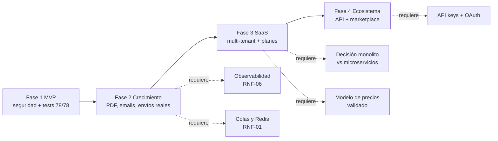

# 5 · Roadmap Estratégico

**CommerceOS — hoja de ruta a 4 fases**
Versión 1.0 · 24/09/2026 · Audiencia: dirección y Product Owner

---

## Índice

1. [Visión y tesis](#1-visión-y-tesis)
2. [Resumen de fases](#2-resumen-de-fases)
3. [Fase 1 · MVP](#3-fase-1--mvp)
4. [Fase 2 · Crecimiento](#4-fase-2--crecimiento)
5. [Fase 3 · SaaS multi-tenant](#5-fase-3--saas-multi-tenant)
6. [Fase 4 · Ecosistema](#6-fase-4--ecosistema)
7. [Dependencias críticas](#7-dependencias-críticas)
8. [Riesgos del portafolio](#8-riesgos-del-portafolio)
9. [KPIs](#9-kpis)

---

## 1. Visión y tesis

**Visión.** Ser la base reutilizable que permita lanzar una tienda online en días y escalar esa misma plataforma a un SaaS multi-tienda con mercado de temas y aplicaciones.

**Tesis de producto.** El valor no está en "tener una tienda" (commoditizado), sino en:

1. **Velocidad de puesta en marcha** — 16 plantillas + constructor visual sin código.
2. **Flexibilidad operativa** — multi-pasarela y multi-transportista por adaptadores.
3. **Escalabilidad de arquitectura** — API stateless lista para extraer a microservicios.
4. **Resiliencia** — experiencia offline-first diferenciadora en mercados con conectividad intermitente.

**Posicionamiento actual vs. objetivo**

| Dimensión | Hoy (Fase 1) | Objetivo (Fase 4) |
|---|---|---|
| Alcance | Tienda individual | Plataforma multi-tienda |
| Ingresos | Licencia única | Suscripción + marketplace |
| Integraciones | 6 pasarelas, 5 carriers stub | Ecosistema certificado |
| Audiencia | Merchant técnico semi-técnico | No técnico + desarrolladores |

---

## 2. Resumen de fases

| Fase | Nombre | Horizonte | Estado | Objetivo central | Criterio de salida |
|---|---|---|---|---|---|
| **1** | **MVP** | 0–2 meses | 🟡 ~80% | Tienda que vende de verdad | Compra completa sin errores · 78/78 tests · secretos fuera de git |
| **2** | **Crecimiento** | 2–6 meses | 🔴 | Operación real y adquisición | Facturación PDF, envíos reales, emails transaccionales, KPIs reales |
| **3** | **SaaS** | 6–12 meses | 🔴 | Multi-tienda y suscripciones | Aislamiento de tenants + planes + trials |
| **4** | **Ecosistema** | 12–24 meses | 🔴 | Marketplace y API pública | API keys, apps de terceros, webhooks salientes |

---

## 3. Fase 1 · MVP

### 3.1 Objetivo

Cerrar el ciclo de compra de extremo a extremo con calidad de producción y eliminar la deuda crítica que impide desplegar.

### 3.2 Alcance

**Funcionalidades (estado actual)**

| Bloque | Funcionalidad | Estado |
|---|---|---|
| Storefront | Home con constructor, catálogo con filtros, ficha con variantes, carrito, checkout 3 pasos, cuenta | ✅ |
| Pagos | 6 adaptadores; UI operativa para Rapyd, Stripe, Mercado Pago y Wompi | 🟡 |
| Envíos | CRUD + tracking público + 5 adaptadores simulados | 🟡 |
| Panel | 18 pantallas, permisos por rol, auditoría, reportes con export | ✅ |
| Tienda | 24 secciones, 16 plantillas, estilos globales, undo/redo | ✅ |
| Plataforma | API 110 endpoints, 37 tablas, offline-first, Web Push | ✅ |

**Trabajo pendiente en esta fase (blocker)**

1. 🔴 Rotar y purgar secretos de `.env copy` (T-001).
2. 🔴 Proteger endpoints sin permiso: `GET /admin/productos`, `GET/POST /admin/usuarios`, `POST/DELETE /admin/upload` (T-002…T-004).
3. 🔴 Restringir CORS y añadir cabeceras de seguridad (T-005, T-010).
4. 🔴 Corregir `PaymentService::crearEnvioAutomatico()` y los 8 tests rojos (T-007, T-008, T-013, T-014) → **78/78**.
5. 🔴 Guard de rol en el middleware del frontend (T-009).
6. 🔴 CI de backend y `build` en CI de frontend (T-011, T-012).

### 3.3 Riesgos de la fase

| Riesgo | Prob. | Impacto | Mitigación |
|---|---|---|---|
| Desplegar con secretos filtrados | **Alta (ya en git)** | Crítico | Rotación inmediata antes de cualquier despliegue |
| Checkout falla al confirmar pago | Alta | Crítico | T-007 con test de regresión |
| Acceso no autorizado al panel | Media | Alto | T-002…T-004 + guard de rol front |
| Regresiones sin red de seguridad | Alta | Alto | Gate de CI con 78/78 |

### 3.4 Dependencias

- Corrección de seguridad **antes** de cualquier exposición pública.
- `php artisan test` en CI como puerta de fusión obligatoria.
- `.env` real del frontend (hoy `Api.ts` tiene `localhost` hardcodeado).

### 3.5 KPIs de salida

| KPI | Meta |
|---|---|
| Pruebas automatizadas | 78/78 en verde |
| Vulnerabilidades P1 abiertas | 0 |
| Errores de consola en flujo de compra | 0 |
| Cobertura de endpoints críticos (carrito, checkout, pago) con tests | 100% |
| Tiempo de carga home (LCP) | < 2,5 s |

---

## 4. Fase 2 · Crecimiento

### 4.1 Objetivo

Convertir el MVP en una **operación real**: que un merchant pueda facturar, enviar, notificar y tomar decisiones con datos verídicos.

### 4.2 Funcionalidades

**Bloque operativo (prioridad alta)**

| # | Funcionalidad | Trabajo asociado | Impacto |
|---|---|---|---|
| 1 | **Facturación PDF** y etiquetas de envío (dompdf/mPDF ya instalados) | HU-031, RF-034/RF-037 | Habilita operación formal |
| 2 | **Emails transaccionales** con cola (`queue:work`) | HU-030, T-020 | Confianza y soporte |
| 3 | **Envíos con tarifas reales** (al menos 2 carriers conectados) | HU-029, RF-035 | Costos correctos |
| 4 | **Detalle de pedido admin** (`GET /admin/pedidos/{id}`) + notas | T-026, RF-030 | Operación diaria |
| 5 | **Dashboard con métricas reales** (fin de `Math.random()`) | HU-027, T-027, RF-042 | Decisiones basadas en datos |
| 6 | **Reembolsos y cancelaciones** completos con notificación | RF-033 | Ciclo de vida de pago |

**Bloque de crecimiento**

| # | Funcionalidad | Trabajo asociado |
|---|---|---|
| 7 | ✅ **SEO técnico**: `sitemap.xml`, canonical, hreflang, páginas legales con layout | HU-034, T-028 |
| 8 | ✅ **Newsletter y contacto** con persistencia (doble opt-in, campañas con vista previa y baja) | HU-033 |
| 9 | **Centro de soporte** con tickets y `/ayuda` real | HU-035 |
| 10 | **Usuarios y roles editables** desde la UI | HU-025, HU-026 |
| 11 | **Auditoría consultable** en panel | HU-036 |

**Bloque de calidad (transversal)**

| # | Iniciativa | Trabajo asociado |
|---|---|---|
| 12 | Rendimiento: Redis, caché de API, eager loading, índices, imágenes optimizadas | T-019…T-024 |
| 13 | E2E de compra con Playwright | T-016 |
| 14 | Consolidación de editores de tienda | T-025 |
| 15 | ✅ `webhook_events` con reintentos (dead-letter manual vía estado `error`) | RF-032 |

### 4.3 Riesgos

| Riesgo | Mitigación |
|---|---|
| Integraciones de carrier toman más de lo estimado (APIs con certificación) | Conectar 2 carriers primero; mantener stub como fallback |
| Colas añaden complejidad operativa | Supervisores + health check + alertas desde el inicio |
| El SEO llega tarde y penaliza el tráfico | Priorizar sitemap y canonical en el primer mes de la fase |
| Scope creep por agregación de blog/tickets | Mantener en backlog priorizado; validar con PO |

### 4.4 Dependencias

- Fase 1 cerrada (0 vulnerabilidades P1).
- Infraestructura de observabilidad (logs estructurados, métricas, alertas) — RNF-06 está en 🔴.
- Definición del modelo de negocio de la Fase 3 (planes y precios).

### 4.5 KPIs

| KPI | Meta |
|---|---|
| Tasa de conversión del checkout | ≥ 60% (carrito → pedido pagado) |
| Errores 5xx por semana | < 0,5% de las peticiones |
| TTFB API (p95) | < 500 ms |
| LCP storefront (p95) | < 2,5 s |
| Emails transaccionales entregados | ≥ 98% |
| Cobertura de tests E2E del flujo de compra | 100% |
| Tiempo de exportación de reporte (p95) | < 5 s |

---

## 5. Fase 3 · SaaS multi-tenant

### 5.1 Objetivo

Pasar de **una tienda por instalación** a **muchas tiendas sobre la misma plataforma**, con planes de suscripción y facturación recurrente.

### 5.2 Funcionalidades

| # | Funcionalidad | Origen de diseño | Estado |
|---|---|---|---|
| 1 | **Multi-tenant** (Shared Database, Schema-per-Tenant) | `microservicios_plan.md` §6 | 🔴 |
| 2 | Resolución de tienda por dominio/subdominio | `microservicios_plan.md` | 🔴 |
| 3 | Aislamiento de datos con `tenant_id` en `settings`, `products`, `orders` | — | 🔴 |
| 4 | Panel de Super Administrador (crear tiendas, ver métricas de plataforma) | SRS actor A6 | 🔴 |
| 5 | **Planes y límites** (productos, storage, pedidos, usuarios) | RF-051 | 🔴 |
| 6 | **Trials** y facturación recurrente | RF-051 | 🔴 |
| 7 | Onboarding guiado (checklist de lanzamiento) | — | 🔴 |
| 8 | Temas por tienda con herencia de configuración | RF-047 | 🟡 (16 plantillas locales) |
| 9 | Multi-moneda y multi-impuesto | RF-027 | 🔴 |
| 10 | Dominios personalizados y SSL automático | — | 🔴 |

### 5.3 Decisión de arquitectura pendiente

El repositorio contiene dos caminos documentados; **requiere decisión de dirección**:

| Opción | Ventaja | Costo |
|---|---|---|
| **A. Monolito + `tenant_id`** (recomendada para iniciar) | Menor complejidad, despliegue único | Refactor de queries; riesgo de fugas si no se blinda |
| **B. Migración a microservicios** (`plan_migracion_detallado.md`) | Escalabilidad y desacople | 9 bounded contexts, API Gateway, esfuerzo de 6–12 meses |

**Recomendación:** iniciar por A con los dominios ya separados en `app/Services` (`Payment/`, `Shipping/`), y reservar B como evolución cuando el tráfico lo justifique.

### 5.4 Riesgos

| Riesgo | Impacto | Mitigación |
|---|---|---|
| Fuga de datos entre tenants | **Crítico** | Tests de aislamiento obligatorios por release; revisión de toda query con `tenant_id` |
| Refactor de BD con datos reales | Alto | Migraciones expand/contract + backups verificados |
| Costo de infraestructura sin modelo de precios validado | Alto | Validar precios con 5–10 merchants antes de construir billing |
| Migración a microservicios prematura | Alto | Gate: solo iniciar B si Fase 2 muestra límites de escala reales |

### 5.5 Dependencias

- Fase 2 estable (observabilidad y colas funcionando).
- Modelo de precios validado comercialmente.
- Equipo con capacidad de re-arquitectura (estimado: 2 personas × 6 meses para la opción A).

### 5.6 KPIs

| KPI | Meta |
|---|---|
| Tiendas activas en la plataforma | ≥ 50 |
| Aislamiento de datos | 0 incidentes de fuga |
| Tiempo de alta de una tienda nueva | < 30 min |
| Churn mensual | < 5% |
| Uptime | ≥ 99,5% |
| Ingreso mensual recurrente (MRR) | Meta según negocio |

---

## 6. Fase 4 · Ecosistema

### 6.1 Objetivo

Abrir la plataforma a terceros: **marketplace de temas y aplicaciones, API pública madura y red de integraciones certificadas**.

### 6.2 Funcionalidades

| # | Funcionalidad | Origen | Estado |
|---|---|---|---|
| 1 | **API pública con API keys** y límites de uso | RF-045 | 🔴 |
| 2 | **OpenAPI/Swagger** + portal de desarrolladores | RF-045 | 🔴 |
| 3 | **Webhooks salientes** para apps de terceros | RF-032 | 🔴 |
| 4 | **OAuth / scopes** por aplicación | RF-048 | 🔴 |
| 5 | **Marketplace de temas** (descarga de terceros) | RF-047 | 🟡 |
| 6 | **Marketplace de apps** (instalación desde panel) | RF-048 | 🔴 |
| 7 | **PayU conectado** (`PAYU_IMPLEMENTATION_PLAN.md`) | RF-031 | 🔴 |
| 8 | **PayPal operativo en UI** | RF-031 | 🔴 |
| 9 | Multi-moneda completa con tipo de cambio | RF-027 | 🔴 |
| 10 | Blog / contenidos nativos | RF-039 | 🔴 |
| 11 | Certificación de integraciones (pasarelas y carriers) | RF-046 | 🔴 |

### 6.3 Riesgos

| Riesgo | Mitigación |
|---|---|
| API inestable daña la reputación con desarrolladores | Versionado estricto (`/v1`), política de deprecación, changelog |
| Apps maliciosas comprometen tiendas | Revisión obligatoria, scopes mínimos, sandbox |
| Marketplace sin liquidez inicial | Empezar con temas propios y 3–5 apps de socios |
| Soporte de terceros aumenta carga operativa | Documentación + portal + SLA por plan |

### 6.4 Dependencias

- Fase 3 con multi-tenant resuelto (las apps deben ser multi-tienda).
- API keys y portal de desarrolladores previos.
- Equipo de plataforma dedicado (no solo producto).

### 6.5 KPIs

| KPI | Meta |
|---|---|
| Desarrolladores registrados | ≥ 100 |
| Apps publicadas en el marketplace | ≥ 25 |
| Temas publicados por terceros | ≥ 50 |
| Llamadas API por día (con keys) | ≥ 100 000 |
| Tiendas con al menos 1 app instalada | ≥ 40% |
| Ingreso por marketplace (take rate) | Meta según negocio |

---

## 7. Dependencias críticas

**Cuellos de botella identificados**

1. **Seguridad de la Fase 1** — sin cerrarla, nada más debe salir a producción.
2. **Observabilidad** — sin logs/métricas/alertas, la Fase 2 se opera a ciegas.
3. **Decisión de arquitectura multi-tenant** — bloquea el inicio real de la Fase 3.
4. **Modelo de negocio** — sin precios validados, la Fase 3 no tiene sentido comercial.

---

## 8. Riesgos del portafolio

| # | Riesgo | Fase | Prob. | Impacto | Respuesta |
|---|---|---|---|---|---|
| 1 | Secretos comprometidos explotados | 1 | Alta | Crítico | **Mitigar ya**: rotar + `git filter-repo` + escaneo CI |
| 2 | Pago falla en producción (bug `shipments`) | 1 | Alta | Crítico | **Mitigar**: T-007 + test |
| 3 | Fuga de datos entre tenants | 3 | Media | Crítico | **Mitigar**: tests de aislamiento + revisión de queries |
| 4 | Competencia (Shopify, WooCommerce, VTEX) | Todas | Alta | Alto | **Aceptar/Apuntalar**: nicho, velocidad y precio |
| 5 | Migración a microservicios prematura | 3 | Media | Alto | **Evitar**: gate de datos antes de iniciar |
| 6 | Deuda técnica acumulada (editores duplicados, tests rojos) | 1–2 | Alta | Medio | **Mitigar**: backlog técnico P2/P4 |
| 7 | Marketplace sin adopción | 4 | Media | Medio | **Mitigar**: sembrar con socios antes de abrir |
| 8 | Costo de infraestructura supera ingresos | 3 | Media | Alto | **Mitigar**: validar precios y hacer proyecciones con métricas reales |

---

## 9. KPIs

### 9.1 Por fase

| Fase | KPI principal | Meta | KPIs de apoyo |
|---|---|---|---|
| **1 · MVP** | Compra completa sin errores | 100% del flujo E2E en verde | 78/78 tests · 0 P1 de seguridad · LCP < 2,5 s |
| **2 · Crecimiento** | Conversión checkout | ≥ 60% | 5xx < 0,5% · TTFB < 500 ms · emails ≥ 98% |
| **3 · SaaS** | Tiendas activas | ≥ 50 | Churn < 5% · uptime ≥ 99,5% · MRR |
| **4 · Ecosistema** | Apps publicadas | ≥ 25 | 100 dev registrados · 100k llamadas/día · 40% tiendas con app |

### 9.2 Indicadores transversales (medir desde la Fase 1)

| Categoría | Indicador | Frecuencia |
|---|---|---|
| **Calidad** | % de pruebas automatizadas en verde | Por release |
| **Calidad** | Bugs P1 abiertos | Semanal |
| **Seguridad** | Vulnerabilidades abiertas por severidad | Semanal |
| **Rendimiento** | LCP, TTFB, p95 de API | Semanal |
| **Operación** | Disponibilidad y errores 5xx | Continua |
| **Producto** | Tiendas creadas · productos publicados · pedidos pagados | Mensual |
| **Negocio** | Activación (tienda que hace su 1er pedido) · churn · MRR | Mensual |

---

## Resumen ejecutivo

| | |
|---|---|
| **Hoy** | MVP ~80% funcional: comercio completo, 18 pantallas admin, constructor visual, 110 endpoints. |
| **Lo que impide producir** | Secretos en git, 3 endpoints sin permiso, 8 tests rojos, un bug que rompe la confirmación de pago. |
| **Siguiente decisión** | Cerrar Fase 1 (≈2–3 semanas de hardening) antes de invertir en crecimiento. |
| **Palanca de valor a 6 meses** | Fase 2: facturación, envíos reales, emails y métricas reales → tienda operable de verdad. |
| **Tesis a 12–24 meses** | Fases 3 y 4: de plantilla reutilizable a plataforma SaaS con ecosistema. |

---

*Vuelve al [índice](00-Indice-Documentacion.md) · Anterior: [Plan Scrum](04-Plan-Scrum.md)*
